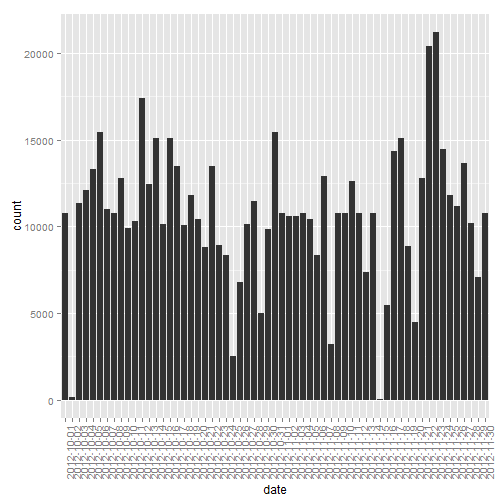

#Reproducible Research - Peer Assessment 1


## Loading and preprocessing the data
First we are going to load the relevant libraries:

```r
library(dplyr)
library(ggplot2)
library(lattice)
library(dclone)
```
Now read the data:

```r
aData = read.csv("activity.csv")
summary(aData)
```

```
##      steps                date          interval     
##  Min.   :  0.00   2012-10-01:  288   Min.   :   0.0  
##  1st Qu.:  0.00   2012-10-02:  288   1st Qu.: 588.8  
##  Median :  0.00   2012-10-03:  288   Median :1177.5  
##  Mean   : 37.38   2012-10-04:  288   Mean   :1177.5  
##  3rd Qu.: 12.00   2012-10-05:  288   3rd Qu.:1766.2  
##  Max.   :806.00   2012-10-06:  288   Max.   :2355.0  
##  NA's   :2304     (Other)   :15840
```

## What is mean total number of steps taken per day?
First we will calculate the needed data for this part:

```r
byDate = group_by(aData, date)
summ = summarise(byDate,count=sum(steps, na.rm=TRUE))
summary(summ)
```

```
##          date        count      
##  2012-10-01: 1   Min.   :    0  
##  2012-10-02: 1   1st Qu.: 6778  
##  2012-10-03: 1   Median :10395  
##  2012-10-04: 1   Mean   : 9354  
##  2012-10-05: 1   3rd Qu.:12811  
##  2012-10-06: 1   Max.   :21194  
##  (Other)   :55
```
The total number of steps per day:

```r
ggplot(data = summ,aes(date,count))+ geom_bar(stat="identity")+theme(axis.text.x = element_text(angle = 90, hjust = 1))
```


Mean number of steps:

```r
mean(summ$count)
```

```
## [1] 9354.23
```
Median number of steps:

```r
median(summ$count)
```

```
## [1] 10395
```
## What is the average daily activity pattern?
The average number of steps time series is:

```r
byInterval = group_by(aData, interval)
interSumm = summarise(byInterval,mean=mean(steps, na.rm=TRUE))
ggplot(data=interSumm, aes(interval,mean)) + geom_line()
```

 
The interval with maximum average number of steps is:

```r
interSumm[which.max(interSumm$mean),]
```

```
## Source: local data frame [1 x 2]
## 
##   interval     mean
## 1      835 206.1698
```
## Imputing missing values
The total number of incomplete rows (rows with NAs):

```r
sum(!complete.cases(aData))
```

```
## [1] 2304
```
Imputating missing values, by interval mean:

```r
fullData = dclone(aData)
for(i in 1:nrow(fullData)){
		if(!complete.cases(fullData[i,])){
			fullData[i,]$steps = interSumm[interSumm$interval==fullData[i,]$interval,]$mean;
		}
}
```
The total number of steps per day:

```r
fullByDate = group_by(fullData, date)
fullSumm = summarise(fullByDate,count=sum(steps))
ggplot(data = fullSumm,aes(date,count))+ geom_bar(stat="identity")+theme(axis.text.x = element_text(angle = 90, hjust = 1))
```


Mean number of steps:

```r
mean(fullSumm$count)
```

```
## [1] 10766.19
```
Median number of steps:

```r
median(fullSumm$count)
```

```
## [1] 10766.19
```
As can be seen, the values recieved are higher than those in the first part. In the original data set we had a few missing complete days. Imputing the values created data for complete days, which shifted completely the mean and median.
## Are there differences in activity patterns between weekdays and weekends?
First, we are going to generate the weekend/weekday variable:

```r
dData = dclone(fullData)
#dData$date = strptime(dData$date, format="%Y-%m-%d")
dData$wday = "weekday"
for(i in 1:nrow(dData)){
	if(strptime(dData[i,]$date, format="%Y-%m-%d")$wday %in% c(0,6)){
		dData[i,]$wday = "weekend"
	}
}
dData$wday = as.factor(dData$wday)
str(dData)
```

```
## 'data.frame':	17568 obs. of  4 variables:
##  $ steps   : num  1.717 0.3396 0.1321 0.1509 0.0755 ...
##  $ date    : Factor w/ 61 levels "2012-10-01","2012-10-02",..: 1 1 1 1 1 1 1 1 1 1 ...
##  $ interval: int  0 5 10 15 20 25 30 35 40 45 ...
##  $ wday    : Factor w/ 2 levels "weekday","weekend": 1 1 1 1 1 1 1 1 1 1 ...
```
And now the plot creation:

```r
byWdayInterval = group_by(dData, wday ,interval)
WISumm = summarise(byWdayInterval,mean=mean(steps))
xyplot(mean~interval|wday,WISumm,type="l")
```

 
